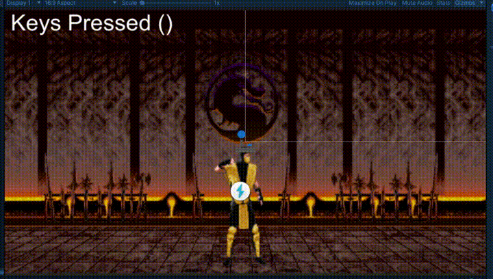

# FGI (Fighting Game Input)
  A concept for an alternative way of executing skills on MMORPGs which has a tons of it, inspired by the ingenuity found on fighting games.

This is heavily based on FadrikAlexander's Game-Mechanics-Quest/Fighting Combos System, and I just made some changes that I think would improve the workflow for designers and response time. 

